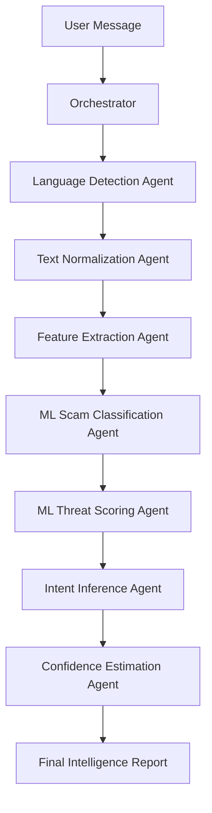

# Agentic Honey-Pot: Scam Intelligence Extraction API

[](https://opensource.org/licenses/MIT)
[](https://www.python.org/downloads/)
[](https://fastapi.tiangolo.com/)

**Agentic Honey-Pot** is a sophisticated, multi-agent orchestrated pipeline designed to detect and analyze scams with high precision. By leveraging a series of specialized AI agents and transformer-based ML models, it extracts deep threat intelligence from suspicious messages, providing quantified threat scores, intent analysis, and entity extraction.

## 🚀 Key Features

- **Multi-Agent Orchestration**: A modular pipeline where specialized agents handle different stages of analysis.
- **ML-Powered Detection**: Uses transformer models (like DistilBERT) for accurate scam classification and threat scoring.
- **User-Created API Keys**: Secure, hashed API keys stored in PostgreSQL using Prisma.
- **API Management UI**: Dedicated UI for creating, listing, and deleting API keys.
- **Deep Intelligence Extraction**:
  - **Scam Type Classification**: Identifies 10+ categories of scams.
  - **Threat Level & Scoring**: Provides a 0-100 quantified threat score.
  - **Intent Inference**: Understands the motivation behind the attack.
  - **Entity Extraction**: Automatically pulls URLs, emails, phone numbers, and monetary amounts.
- **High Performance**: Optimized for low latency and high throughput using FastAPI.
- **Extensible Architecture**: Easily add new agents or update existing ones.

## 🏗️ Architecture

The project follows a modular multi-agent system architecture:



## 🛠️ Getting Started

### Prerequisites

- Python 3.9 or higher
- `pip` or `poetry`

### Installation

1. **Clone the repository:**

   ```bash
   git clone https://github.com/Pratham200Rajbhar/Agentic-Honey-Pot.git
   cd Agentic-Honey-Pot
   ```

2. **Set up a virtual environment:**

   ```bash
   python -m venv .venv
   source .venv/bin/activate  # On Windows: .venv\Scripts\activate
   ```

3. **Install dependencies:**

   ```bash
   pip install -r requirements.txt
   ```

4. **Database & Environment Setup:**
   - Ensure PostgreSQL is running.
   - Copy the example environment file:
     ```bash
     cp .env.example .env
     ```
   - Update `DATABASE_URL` in `.env` with your PostgreSQL credentials.
   - Run Prisma migrations and generate client:
     ```bash
     prisma db push
     prisma generate
     ```

### Running the API

Start the FastAPI server:

```bash
uvicorn app.main:app --reload
```

The API will be available at `http://localhost:8000`. You can access the interactive documentation at `http://localhost:8000/docs`.

## 📖 API Usage

### Analyze a Message

**Endpoint:** `POST /api/honeypot`

**Request Body:**

```json
{
  "message": "Urgent! Your account has been locked. Click here to verify: http://scam-link.com"
}
```

**Example Response:**

```json
{
  "analysis_id": "uuid-v4-string",
  "scam_type": "Phishing",
  "threat_level": "High",
  "threat_score": 95,
  "intent": "Credential theft and account takeover",
  "confidence_score": 0.98,
  "language": "en",
  "extracted_entities": {
    "urls": ["http://scam-link.com"],
    "emails": [],
    "phones": [],
    "amounts": []
  }
}
```

## 📂 Project Structure

- `app/`: Core application logic.
  - `agents/`: Individual specialized agents.
  - `orchestrator.py`: Pipeline coordination logic.
  - `main.py`: FastAPI application entry point.
- `models/`: Pre-trained ML models and metadata.
- `scripts/`: Training and utility scripts.
- `tests/`: Automated test suite.
- `docs/`: In-depth documentation and design specs.

## 🤝 Contributing

We welcome contributions! Please see our [CONTRIBUTING.md](CONTRIBUTING.md) for guidelines.

## 📄 License

This project is licensed under the MIT License - see the [LICENSE](LICENSE) file for details.

## 🛡️ Code of Conduct

Please adhere to our [Code of Conduct](CODE_OF_CONDUCT.md) in all interactions.
